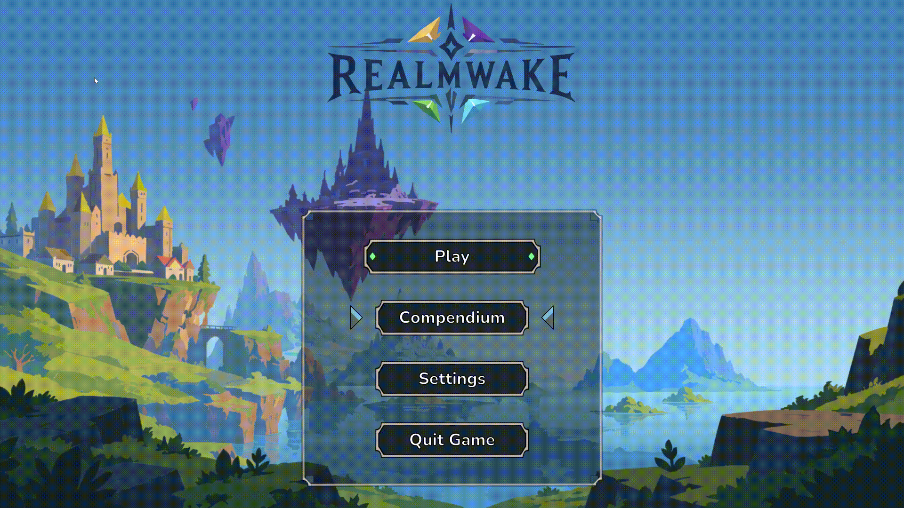
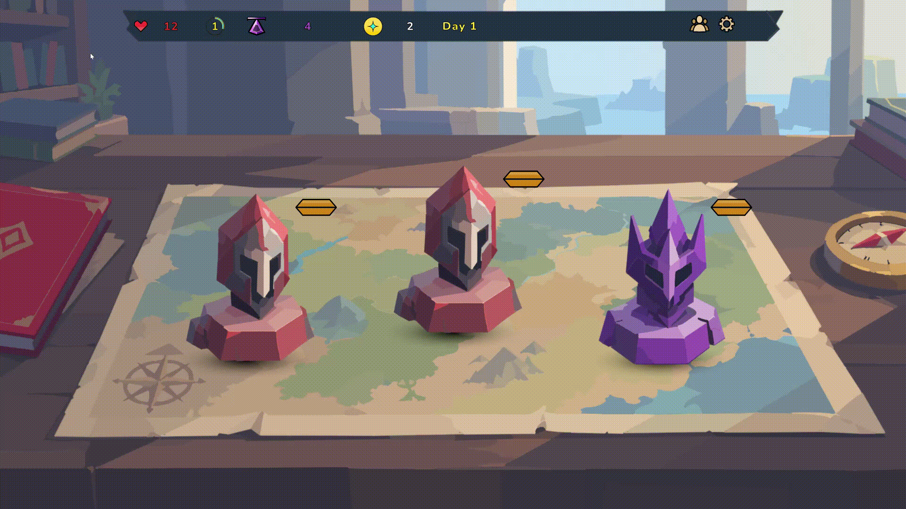

# Realmwake

> A tactical roguelike autobattler where you assemble a battalion across fractured realms, discover powerful unit synergies, and survive 12 days of escalating encounters.

 

---

## ⚔️ About the Game
**Realmwake** is a grid-based roguelike autobattler about building an army from across four distinct realms. Position units to exploit their abilities and synergies, manage limited resources, and chart a path through 12 days of battles, shops, and unpredictable encounters.

* **Build Across Realms:** Recruit units from distinct realms, each with its own mechanics, archetypes, and strategies.
* **Tactical Autobattling:** Position your battalion on a grid and build around ability timing, targeting, and unit interactions.
* **Create Synergies:** Combine specialized units and bridging mechanics to turn individual abilities into powerful compositions.
* **Choose Your Path:** Navigate 12 days of combats, shops, rewards, and story events while preparing for increasingly dangerous encounters.
* **Push Your Luck:** Take calculated risks, recover from losses, and adapt your strategy when a run doesn't go according to plan.

---

## Explore Four Realms

Solmire — Medieval warriors, constructs, and disciplined battlefield synergies.
Nethervale — Death, sacrifice, summons, and dangerous power at a price.
Everborn — Primal forces and elemental creatures.
Axiom — Advanced technology and mechanically driven strategies.

---

## 🛠️ Technical Highlights
This project also serves as a showcase of modular gameplay architecture and responsive UI implementation in Unity.

* **ScriptableObject Architecture:** All game events (Combat, Level Ups, Story Events) and Unit definitions are driven by modular ScriptableObjects, allowing for rapid design iteration without touching core code.
* **Decoupled Combat System:** Built on a custom `CombatEventBus`, ensuring that unit stats, damage calculations, and UI updates (like damage numbers and health bars) communicate seamlessly without rigid dependencies.
* **Composable Combat Mechanics:** Units interact through reusable targeting, status-effect, cooldown, summon, and combat-event systems, allowing new abilities to be implemented without bespoke combat logic.
* **Advanced UI & UX:** 
  * Features a dynamic, scale-aware tooltip system.
  * Uses TextMeshPro and Unity Layout Groups to maintain consistent layouts across resolutions.
  * Cinematic UI transitions driven by programmatic animations (bouncy pop-ins, heavy slams, and color adjustments).

---

## 🚀 Getting Started
To view or play the project locally:
1. Clone this repository.
2. Open the project in Unity 6.3.
3. Open the 'Bootstrap' and hit Play!

OR:
1. Visit [itch.io](https://tsainoah.itch.io/realmwake) and download the up to date demo with password: "chef"
2. Extract the downloaded archive and launch the game.