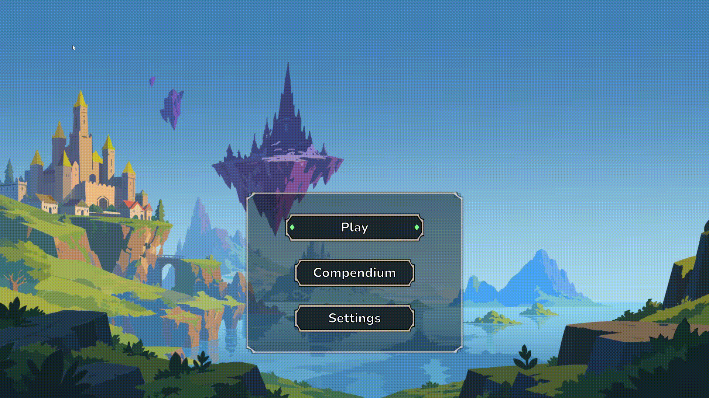

# Realm Break (Working Title)

> A tactical roguelike autobattler where you construct the ultimate battalion to weather deadly encounters and survive 12 days of escalating challenges.

 

---

## ⚔️ About the Game
**Realm Break** is a grid-based autobattler that challenges players to make high-stakes tactical decisions. Build your army, manage your economy, and choose your path through a dynamic daily event system.

* **Grid-Based Autobattling:** Position your units strategically on the battlefield to maximize their synergies and mitigate enemy threats.
* **Roguelike Progression:** Navigate through varied daily events, choosing between combats, shops, and mysterious story encounters.
* **Identify synergies:** Learn to recognize synergies between units in a pool of unique characters with bridging mechanics.
* **Risk & Reward:** Salvage gold from lost battles and trigger "Last Chance" safety nets to bounce back from the brink of defeat.

---

## 🛠️ Technical Highlights
As a portfolio piece, this project showcases clean, decoupled architecture and highly polished UI implementation within Unity:

* **ScriptableObject Architecture:** All game events (Combat, Level Ups, Story Events) and Unit definitions are driven by modular ScriptableObjects, allowing for rapid design iteration without touching core code.
* **Decoupled Combat System:** Built on a custom `CombatEventBus`, ensuring that unit stats, damage calculations, and UI updates (like damage numbers and health bars) communicate seamlessly without rigid dependencies.
* **Advanced UI & UX:** 
  * Features a dynamic, scale-aware tooltip system.
  * Utilizes `TextMeshPro` with precise Layout Groups for flawless scaling across resolutions.
  * Cinematic UI transitions driven by programmatic animations (bouncy pop-ins, heavy slams, and color adjustments).

---

## 🚀 Getting Started
To view or play the project locally:
1. Clone this repository.
2. Open the project in Unity 6.3.
3. Open the 'Bootstrap' and hit Play!

OR:
1. Visit [itch.io](https://tsainoah.itch.io/fantasy-chess) and download the up to date demo with password: "chef"
2. unZip and play!